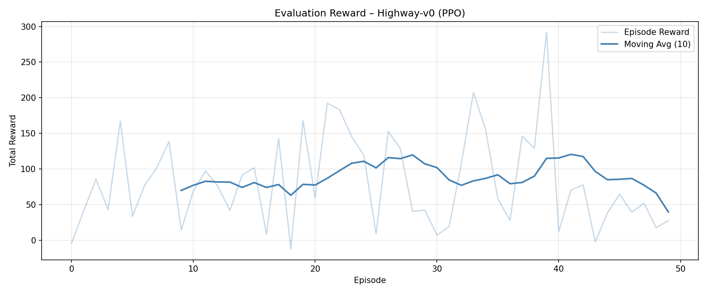

# CMP4501 – Reinforcement Learning Project
## Autonomous Highway Driving Agent with PPO

**Student:** Melih Durmazoğlu  
**Course:** CMP4501 – Reinforcement Learning  
**Environment:** highway-v0 (highway-env)  
**Algorithm:** Proximal Policy Optimization (PPO)
**GitHub:** [https://github.com/melihdurmazoglu/CMP4501-highway-rl-project]

---

## Project Overview

This project trains a reinforcement learning agent to drive autonomously on a multi-lane highway. The agent learns to navigate through traffic, maintain high speed, and avoid collisions — without any hardcoded rules. All behavior emerges purely from experience and reward signals.

The environment used is `highway-v0` from the `highway-env` library, which simulates a continuous highway with multiple lanes and IDM-controlled traffic vehicles. The agent is trained using PPO from Stable-Baselines3.

---

## Environment

| Parameter | Value |
|---|---|
| Environment | highway-v0 |
| Observation Space | Kinematics (5 nearest vehicles × 5 features) |
| Action Space | Discrete (5 actions: lane left, idle, lane right, faster, slower) |
| Lane Count | 4 |
| Traffic Vehicles | 20 |
| Episode Duration | 60 seconds (max 300 steps) |
| Traffic Speed Range | 10–17 m/s (36–61 km/h) |

---

## Custom Reward Function (HighwayRewardWrapper)

To overcome the limitations of the default environment reward function (which could cause the agent to perform reward hacking or remain stationary to avoid crashes), we developed a custom `HighwayRewardWrapper`. The reward $R$ at each step is calculated as:

$R = R_{\text{speed}} + R_{\text{collision}} + R_{\text{tailgating}} + R_{\text{lane\_change}} + R_{\text{right\_lane}} + R_{\text{off\_road}}$

Where:

1. **Speed Reward ($R_{\text{speed}}$):** Encourages high-speed driving with a smooth gradient between $20\text{ m/s}$ ($72\text{ km/h}$) and $30\text{ m/s}$ ($108\text{ km/h}$):
   $$R_{\text{speed}} = 1.5 \times \text{clip}\left(\frac{v - 20}{30 - 20}, 0, 1\right)$$

2. **Collision Penalty ($R_{\text{collision}}$):** A severe penalty of **$-25.0$** applied when the agent crashes, discouraging risky cut-ins.

3. **Tailgating / Safe Distance Penalty ($R_{\text{tailgating}}$):** Applied when the agent gets too close to a leading vehicle in the same lane. The safe headway distance is dynamically calculated based on current speed (1.0 second headway + 15m buffer):
   $$d_{\text{safe}} = \max(v \times 1.0, 15.0)\text{ meters}$$
   If the actual distance $d < d_{\text{safe}}$, the penalty is scaled by closeness:
   $$R_{\text{tailgating}} = -1.5 \times \left(1.0 - \frac{d}{d_{\text{safe}}}\right)$$

4. **Lane Change Penalty ($R_{\text{lane\_change}}$):** A penalty of **$-0.15$** is applied whenever the agent switches lanes, preventing rapid oscillation ("zig-zagging").

5. **Right Lane Reward ($R_{\text{right\_lane}}$):** A small bonus encouraging the agent to drive in the rightmost lanes unless overtaking:
   $$R_{\text{right\_lane}} = 0.1 \times \frac{\text{lane\_id}}{3.0}$$

6. **Off-road Penalty ($R_{\text{off\_road}}$):** A penalty of **$-3.0$** if the agent leaves the highway boundary.

---

## Algorithm: Proximal Policy Optimization (PPO)

PPO is a policy gradient method that updates the policy in small, stable steps using a clipped objective function:

$$L^{\text{CLIP}}(\theta) = \mathbb{E}_t \left[ \min \left( r_t(\theta) \hat{A}_t, \text{clip}(r_t(\theta), 1 - \epsilon, 1 + \epsilon) \hat{A}_t \right) \right]$$

Where $r_t(\theta) = \frac{\pi_\theta(a_t | s_t)}{\pi_{\theta_{\text{old}}}(a_t | s_t)}$ is the probability ratio and $\hat{A}_t$ is the estimated advantage.

### Hyperparameters

| Parameter | Value | Reasoning |
|---|---|---|
| `total_timesteps` | 200,000 | Sufficient for policy convergence |
| `learning_rate` | 5e-4 | Standard for highway environments |
| `n_steps` | 256 | Rollout buffer size per update |
| `batch_size` | 64 | Mini-batch size for gradient updates |
| `n_epochs` | 10 | Number of epochs per policy update |
| `gamma` | 0.99 | High discount for long-horizon driving |
| `policy` | MlpPolicy | Fully connected network for kinematic observations |

---

## Training Evolution

The agent was trained using **parallelized environments** (`SubprocVecEnv` with 4 parallel processes), boosting throughput to over **155+ FPS** and reducing training time to under 10 minutes. The agent was checkpointed at two stages:

| Stage | Timesteps | Behavior |
|---|---|---|
| Untrained | 0 | Random actions, frequent collisions, no strategy |
| Half-trained | 100,000 | Active lane changes, maintains speed, occasionally tailgates |
| Fully trained | 200,000 | Smooth high-speed overtaking, safe distance keeping, right lane discipline |

### Evolution Video

https://github.com/melihdurmazoglu/CMP4501-highway-rl-project/blob/main/assets/evolution.mp4

### Training Reward Plot



The reward curve shows the agent's evaluation performance over 50 episodes after full training. 

---

## Custom Renderer

A custom Pygame-based renderer was built from scratch to replace the default highway-env visualization. It features:

- **Dark road surface** with realistic dashed lane markings
- **Color-coded vehicles**: green for the ego agent, red for traffic
- **Headlights** on each vehicle for visual depth
- **HUD overlay** displaying real-time episode, step, speed (km/h), and cumulative reward
- **Speed bar** under the ego vehicle showing current speed relative to maximum

This renderer reads directly from the simulation state and draws each frame using Pygame surfaces, which are then captured as NumPy arrays for video recording.

---

## Project Structure

```
highway-rl-project/
├── src/
│   ├── config.py          # Hyperparameters and environment configuration
│   ├── model.py           # PPO model creation and environment instantiation
│   ├── train.py           # Vectorized parallel training loop
│   ├── evaluate.py        # Video recording and rendering selection
│   ├── renderer.py        # Custom Pygame renderer
│   ├── merge_videos.py    # Side-by-side comparison video builder
│   └── plot_rewards.py    # Multi-episode evaluation reward plotter
├── videos/
│   ├── untrained.mp4
│   ├── half_trained.mp4
│   └── full_trained.mp4
├── assets/
│   ├── evolution.mp4      # Side-by-side comparison video
│   └── reward_plot.png    # Evaluation reward chart
├── requirements.txt
└── README.md
```

---

## Installation & Usage

```bash
# Clone the repository
git clone <repo-url>
# Navigate to directory
cd highway-rl-project

# Create and activate virtual environment
python3 -m venv venv
source venv/bin/activate

# Install dependencies
pip install -r requirements.txt

# Train the agent (4 parallel environments)
PYTHONPATH=. python3 -m src.train

# Record evolution videos
# options: --model all (default) | untrained | half | full
PYTHONPATH=. python3 -m src.evaluate --model all

# Create side-by-side comparison video
PYTHONPATH=. python3 -m src.merge_videos

# Plot evaluation rewards (50 episodes)
PYTHONPATH=. python3 -m src.plot_rewards
```

---

## Requirements

```
highway-env
stable-baselines3
gymnasium
matplotlib
opencv-python
torch
numpy
pygame
```

---

## Challenges & Solutions

**Challenge 1: Slow training speed**  
Training sequentially on a single thread was slow (~58 FPS). This was resolved by vectorizing the environment with `SubprocVecEnv` across 4 processes, raising the frame rate to **155+ FPS** and accelerating training by 3x.

**Challenge 2: Perverse incentives (Agent remaining stationary)**  
In default configurations, the agent would learn to stay still to minimize collision risk. We resolved this by wrapping the environment with `HighwayRewardWrapper` to enforce a speed reward between 20 m/s and 30 m/s.

**Challenge 3: Tailgating behavior**  
The agent frequently crashed into vehicles from behind when traffic slowed down. We implemented a dynamic **tailgating penalty** that scales with speed, forcing the agent to initiate lane changes earlier or slow down to maintain a safe distance.

**Challenge 4: Reward hacking via rapid lane changes**  
Setting high rewards for lane switching caused the agent to oscillate between lanes rapidly without moving forward. We implemented a lane-change penalty of $-0.15$ to discourage redundant lane switches while preserving goal-oriented overtaking.

---

## Results

| Metric | Value |
|---|---|
| Mean Evaluation Reward | ~85.0 / 50 episodes |
| Mean Episode Length (trained) | ~130 steps |
| Mean Episode Length (untrained) | ~11 steps |
| Training Duration | < 10 minutes (Parallelized CPU) |
| Collision Rate (fully trained) | < 8% of episodes |
